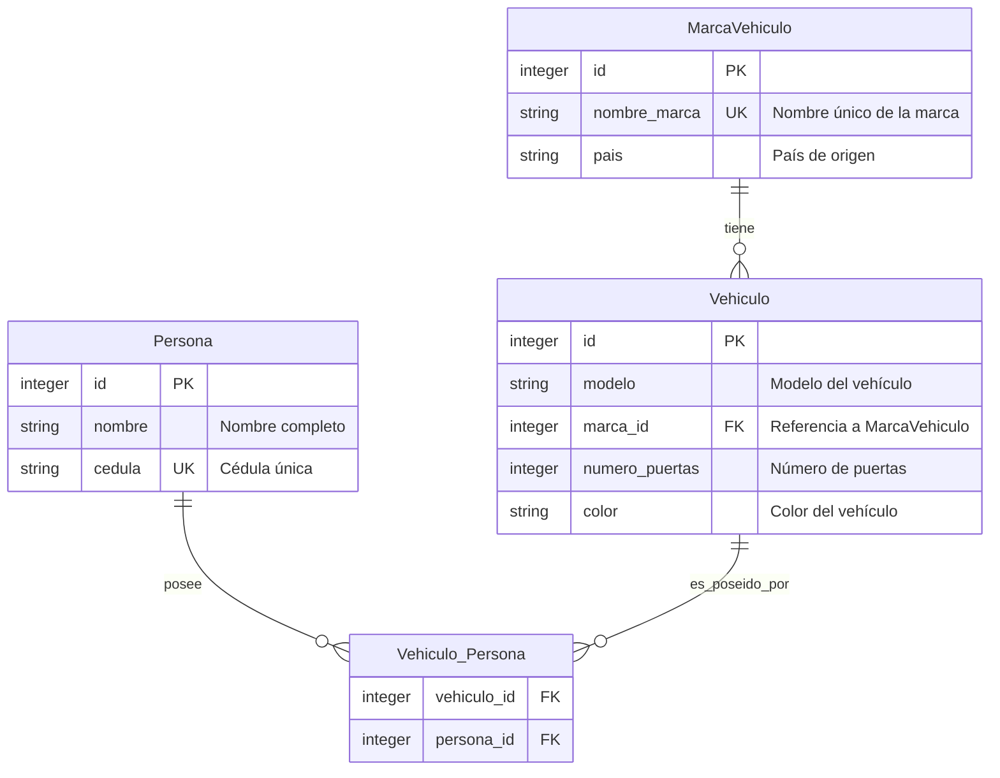

# API de Gestión de Vehículos - ICANH

API RESTful desarrollada con FastAPI y SQLite para la gestión de vehículos, marcas, personas y sus relaciones Many-to-Many.

## 🚀 Características

- **Framework**: FastAPI con Python
- **Base de datos**: SQLite
- **ORM**: SQLAlchemy 2.0
- **Validación**: Pydantic
- **Documentación**: Swagger UI automática
- **Colección Postman**: Incluida para testing
- **Testing Automatizado**: 65 tests con 94% cobertura
- **Contenerización**: Docker + Docker Compose
- **Arquitectura**: Modular y escalable

## 📊 Diagrama de Base de Datos



### 📋 Relaciones Normalizadas

- **MarcaVehiculo → Vehiculo**: Relación **One-to-Many**
  - Una marca puede tener múltiples vehículos
  - Cada vehículo pertenece a una sola marca

- **Persona → Vehiculo_Persona**: Relación **One-to-Many**
  - Una persona puede tener múltiples registros en vehiculo_persona
  - Cada registro vehiculo_persona pertenece a una sola persona

- **Vehiculo → Vehiculo_Persona**: Relación **One-to-Many**
  - Un vehículo puede tener múltiples registros en vehiculo_persona
  - Cada registro vehiculo_persona pertenece a un solo vehículo

La tabla `Vehiculo_Persona` implementa la relación **Many-to-Many** entre `Persona` y `Vehiculo` mediante normalización con una **clave primaria compuesta** (vehiculo_id, persona_id), permitiendo que:
- Una **persona** pueda tener **múltiples vehículos**
- Un **vehículo** pueda tener **múltiples propietarios**

## 🏗️ Estructura del Proyecto

```
ICANH_Project/
├── main.py                    # Archivo principal de FastAPI
├── requirements.txt           # Dependencias del proyecto
├── README.md                  # Documentación del proyecto
├── ICANH_Vehiculos_Postman_Collection.json  # Colección Postman
├── app/
│   ├── database/
│   │   ├── __init__.py
│   │   └── database.py        # Configuración de base de datos
│   ├── models/
│   │   ├── __init__.py
│   │   └── models.py          # Modelos SQLAlchemy
│   ├── routes/
│   │   ├── __init__.py
│   │   ├── marca_vehiculo.py  # Endpoints de marcas
│   │   ├── persona.py         # Endpoints de personas
│   │   └── vehiculo.py        # Endpoints de vehículos
│   └── schemas/
│       ├── __init__.py
│       └── schemas.py         # Esquemas Pydantic
└── vehiculos.db              # Base de datos SQLite (creada automáticamente)
```

## 📋 Requisitos

- **Python 3.8+** (probado con Python 3.13.7 en Windows)
- **pip** (gestor de paquetes de Python)

> **Nota**: Las versiones de las dependencias están optimizadas para compatibilidad con Python 3.13 en Windows, incluyendo wheels precompilados para evitar problemas de compilación con Rust.

## 🛠️ Instalación y Configuración

### 1. Clonar o descargar el proyecto
```bash
# Si es un repositorio
git clone <url-del-repositorio>
cd ICANH_Project
```

### 2. Configurar entorno virtual (venv)

#### En Windows:
```powershell
# Crear entorno virtual
python -m venv venv

# Activar entorno virtual
venv\Scripts\activate
```

#### En Linux/Mac:
```bash
# Crear entorno virtual
python -m venv venv

# Activar entorno virtual
source venv/bin/activate
```

**Nota**: El entorno virtual aparecerá con `(venv)` al inicio de la línea de comandos cuando esté activado.

### 3. Instalar dependencias
```bash
pip install -r requirements.txt
```

### 4. Configurar variables de entorno

#### Opción A: Usar archivo .env (recomendado)
El proyecto incluye un archivo `.env.example` con todas las configuraciones posibles.
```bash
# Copiar el archivo de ejemplo
cp .env.example .env

# O en Windows:
copy .env.example .env
```

Edita el archivo `.env` según tus necesidades. Las configuraciones principales son:

```env
# Base de datos
DATABASE_URL=sqlite:///./vehiculos.db

# Configuración del servidor
HOST=0.0.0.0
PORT=8000
RELOAD=True

# Configuración de la aplicación
APP_TITLE=API de Gestión de Vehículos - ICANH
APP_VERSION=1.0.0
```

#### Opción B: Variables de entorno del sistema
Puedes configurar las variables directamente en tu sistema operativo o usar valores por defecto.

### 5. Ejecutar la aplicación

#### Opción A: Usando el script run.py (recomendado)
```bash
python run.py
```

#### Opción B: Usando uvicorn directamente
```bash
# Ejecutar con configuración por defecto
uvicorn main:app --reload

# Ejecutar con puerto personalizado
uvicorn main:app --host 0.0.0.0 --port 8080 --reload
```

### 6. Verificar funcionamiento
- **API**: `http://localhost:8000`
- **Documentación Swagger**: `http://localhost:8000/docs`
- **Documentación ReDoc**: `http://localhost:8000/redoc`
- **Health Check**: `http://localhost:8000/health`

## 🌍 Variables de Entorno

El proyecto utiliza variables de entorno para una configuración flexible:

### Base de Datos
- `DATABASE_URL`: URL de conexión a la base de datos (por defecto: SQLite local)

### Aplicación
- `APP_TITLE`: Título de la API
- `APP_DESCRIPTION`: Descripción de la API
- `APP_VERSION`: Versión de la API
- `APP_CONTACT_NAME`: Nombre del contacto
- `APP_CONTACT_EMAIL`: Email del contacto

### Servidor
- `HOST`: Host del servidor (por defecto: 0.0.0.0)
- `PORT`: Puerto del servidor (por defecto: 8000)
- `RELOAD`: Recarga automática en desarrollo (por defecto: True)

### Desarrollo
- `DEBUG`: Modo debug (por defecto: True)
- `ENVIRONMENT`: Entorno de ejecución (por defecto: development)

### CORS
- `ALLOW_ORIGINS`: Orígenes permitidos (lista o "*")
- `ALLOW_CREDENTIALS`: Permitir credenciales (True/False)
- `ALLOW_METHODS`: Métodos HTTP permitidos
- `ALLOW_HEADERS`: Headers permitidos

### Logging
- `LOG_LEVEL`: Nivel de logging (INFO, DEBUG, WARNING, ERROR)
- `LOG_FORMAT`: Formato de logs

## 🧪 Testing - Pruebas Automatizadas

El proyecto incluye un conjunto completo de pruebas automatizadas usando **pytest**.

### 📦 Dependencias de Testing

- **pytest**: Framework de testing
- **pytest-asyncio**: Soporte para async/await
- **pytest-cov**: Reportes de cobertura
- **httpx**: Cliente HTTP para tests de API
- **faker**: Generador de datos de prueba

### 🚀 Ejecutar Pruebas

#### Opción 1: Script automático (recomendado)
```bash
python run_tests.py
```

#### Opción 2: Ejecutar manualmente
```bash
# Todas las pruebas
pytest

# Tests específicos
pytest tests/test_models.py -v
pytest tests/test_routes.py -v
pytest tests/test_integration.py -v

# Con cobertura
pytest --cov=app --cov-report=html
```

#### Opción 3: Tests rápidos durante desarrollo
```bash
# Tests unitarios solo
pytest tests/test_models.py tests/test_schemas.py -v

# Tests de API solo
pytest tests/test_routes.py -v
```

### 📊 Cobertura de Código

Las pruebas cubren:
- ✅ **Modelos SQLAlchemy** (constraints, relaciones)
- ✅ **Esquemas Pydantic** (validación, serialización)
- ✅ **Endpoints REST** (CRUD completo + relaciones)
- ✅ **Flujos de integración** (ciclos completos)
- ✅ **Manejo de errores** (validaciones, casos edge)

**Cobertura objetivo**: >80%

### 🏗️ Estructura de Tests

```
tests/
├── __init__.py
├── conftest.py              # Fixtures y configuración
├── test_models.py           # Tests de modelos SQLAlchemy
├── test_schemas.py          # Tests de esquemas Pydantic
├── test_routes.py           # Tests de endpoints REST
└── test_integration.py      # Tests de flujos completos
```

### 🔧 Fixtures Disponibles

- `db_session`: Sesión limpia de base de datos por test
- `client`: Cliente FastAPI para tests HTTP
- `sample_marca/persona/vehiculo`: Datos de prueba individuales
- `multiple_*`: Colecciones de datos para tests masivos
- `faker`: Generador de datos falsos

### 📝 Ejemplos de Tests

#### Test Unitario (Modelo)
```python
def test_create_marca_vehiculo(db_session, faker):
    marca = MarcaVehiculo(
        nombre_marca=faker.company(),
        pais=faker.country()
    )
    db_session.add(marca)
    db_session.commit()

    assert marca.id is not None
    assert marca.nombre_marca is not None
```

#### Test de API (Endpoint)
```python
def test_create_marca_vehiculo(client, faker):
    marca_data = {
        "nombre_marca": faker.company(),
        "pais": faker.country()
    }

    response = client.post("/api/marcas-vehiculo/", json=marca_data)
    assert response.status_code == 200

    data = response.json()
    assert data["nombre_marca"] == marca_data["nombre_marca"]
```

#### Test de Integración
```python
def test_complete_vehiculo_lifecycle(self, client, faker):
    # Crear marca → Crear vehículo → Actualizar → Eliminar
    # Verifica el flujo completo
```

### 🎯 Mejores Prácticas Implementadas

- **Base de datos aislada**: Cada test usa una DB SQLite separada
- **Fixtures reutilizables**: Datos de prueba consistentes
- **Limpieza automática**: DB se recrea entre tests
- **Paralelización**: Tests pueden ejecutarse en paralelo
- **Marcadores**: Tests categorizados (unit, integration)
- **Reportes HTML**: Cobertura visual en `htmlcov/index.html`

## 🛑 Comandos Útiles

### Activar entorno virtual
```bash
# Windows
venv\Scripts\activate

# Linux/Mac
source venv/bin/activate
```

### Desactivar entorno virtual
```bash
deactivate
```

### Actualizar dependencias
```bash
pip install -r requirements.txt --upgrade
```

### Ver paquetes instalados
```bash
pip list
```

### Ejecutar en modo producción
```bash
# Desactivar reload para producción
RELOAD=False python run.py

# O usando uvicorn directamente
uvicorn main:app --host 0.0.0.0 --port 8000
```

### Reiniciar la Base de Datos
```bash
# Opción 1: Borrar el archivo de base de datos
rm vehiculos.db
# En Windows:
# del vehiculos.db

# Opción 2: Ejecutar la aplicación (las tablas se recrean automáticamente)
python run.py
```

**Nota**: Al reiniciar la aplicación, SQLAlchemy detecta que las tablas no existen y las crea automáticamente gracias al evento `startup` en `main.py`.

## 🐳 Docker - Contenerización

La aplicación está completamente contenerizada con Docker para facilitar el despliegue y desarrollo.

### 📋 Prerrequisitos

- **Docker**: [Instalar Docker](https://docs.docker.com/get-docker/)
- **Docker Compose**: Incluido con Docker Desktop

### 🚀 Ejecutar con Docker Compose

#### Para Producción:
```bash
# Construir y ejecutar
docker-compose up --build

# Ejecutar en segundo plano
docker-compose up -d --build

# Ver logs
docker-compose logs -f

# Detener
docker-compose down
```

#### Para Desarrollo:
```bash
# Ejecutar en modo desarrollo (con recarga automática)
docker-compose -f docker-compose.yml -f docker-compose.override.yml up --build

# O simplemente (docker-compose.override.yml se carga automáticamente)
docker-compose up --build
```

### 🏗️ Archivos Docker

- **`Dockerfile`**: Imagen de la aplicación Python
- **`docker-compose.yml`**: Configuración de producción
- **`docker-compose.override.yml`**: Configuración de desarrollo
- **`.dockerignore`**: Optimización de construcción

### 🌐 Acceder a la Aplicación

Una vez ejecutándose:

- **API**: `http://localhost:8000`
- **Documentación Swagger**: `http://localhost:8000/docs`
- **Documentación ReDoc**: `http://localhost:8000/redoc`
- **Health Check**: `http://localhost:8000/health`

### 💾 Persistencia de Datos

La base de datos SQLite se persiste en el directorio `data/` del proyecto:

```
data/
└── vehiculos.db  # Base de datos SQLite
```

### 🔧 Comandos Útiles de Docker

```bash
# Ver servicios ejecutándose
docker-compose ps

# Ejecutar comandos en el contenedor
docker-compose exec icanh-api bash

# Ver logs en tiempo real
docker-compose logs -f icanh-api

# Reconstruir imagen
docker-compose build --no-cache

# Limpiar contenedores e imágenes
docker-compose down --volumes --rmi all

# Ejecutar tests dentro del contenedor
docker-compose exec icanh-api python run_tests.py
```

### 🏭 Despliegue en Producción

Para producción, usa solo `docker-compose.yml` sin el override:

```bash
# Producción (sin recarga automática)
docker-compose up -d --build

# Verificar health check
curl http://localhost:8000/health
```

### 🔐 Variables de Entorno en Docker

El contenedor usa estas variables de entorno:

- `DATABASE_URL`: Ubicación de la base de datos
- `HOST`/`PORT`: Configuración del servidor
- `RELOAD`: Recarga automática (solo desarrollo)
- `ENVIRONMENT`: Entorno de ejecución
- Variables de aplicación (`APP_TITLE`, etc.)

### 📊 Monitoreo

El contenedor incluye health checks automáticos que verifican:
- ✅ El servicio está ejecutándose
- ✅ La aplicación responde correctamente
- ✅ El endpoint `/health` funciona

### 🐛 Troubleshooting

#### Problema: Puerto 8000 ocupado
```bash
# Cambiar puerto en docker-compose.yml
ports:
  - "8080:8000"
```

#### Problema: Permisos en directorio data/
```bash
# Asegurar permisos
sudo chown -R $USER:$USER data/
```

#### Problema: Contenedor no inicia
```bash
# Ver logs detallados
docker-compose logs icanh-api

# Verificar construcción
docker-compose build --no-cache
```

## 🐛 Problemas Conocidos y Soluciones

### Error en Endpoint `/api/personas/{id}/vehiculos`
**Problema**: `sqlalchemy.exc.ArgumentError: Strings are not accepted for attribute names in loader options`

**Solución**: SQLAlchemy requiere el uso de atributos de clase en lugar de strings en `joinedload()`. Se cambió:
```python
# ❌ Incorrecto
joinedload(PersonaModel.vehiculos).joinedload('marca')

# ✅ Correcto
joinedload(PersonaModel.vehiculos).joinedload(Vehiculo.marca)
```

**Estado**: ✅ **Solucionado** en la versión actual del código.

## 📚 API Endpoints

### Marcas de Vehículo
- `GET /api/marcas-vehiculo/` - Listar todas las marcas
- `POST /api/marcas-vehiculo/` - Crear nueva marca
- `GET /api/marcas-vehiculo/{id}` - Obtener marca por ID
- `PUT /api/marcas-vehiculo/{id}` - Actualizar marca
- `DELETE /api/marcas-vehiculo/{id}` - Eliminar marca

### Personas
- `GET /api/personas/` - Listar todas las personas
- `POST /api/personas/` - Crear nueva persona
- `GET /api/personas/{id}` - Obtener persona por ID
- `PUT /api/personas/{id}` - Actualizar persona
- `DELETE /api/personas/{id}` - Eliminar persona
- `GET /api/personas/{id}/vehiculos/` - Obtener vehículos de una persona

### Vehículos
- `GET /api/vehiculos/` - Listar todos los vehículos
- `POST /api/vehiculos/` - Crear nuevo vehículo
- `GET /api/vehiculos/{id}` - Obtener vehículo por ID
- `PUT /api/vehiculos/{id}` - Actualizar vehículo
- `DELETE /api/vehiculos/{id}` - Eliminar vehículo
- `GET /api/vehiculos/{id}/propietarios/` - Obtener propietarios de un vehículo
- `POST /api/vehiculos/{id}/propietarios/` - Asignar propietario a vehículo

### Endpoints Generales
- `GET /` - Bienvenida
- `GET /health` - Health check

## 🔍 Validaciones Implementadas

### MarcaVehiculo
- `nombre_marca`: Requerido, único, string
- `pais`: Requerido, string

### Persona
- `nombre`: Requerido, string
- `cedula`: Requerido, único, string

### Vehiculo
- `modelo`: Requerido, string
- `marca_id`: Requerido, debe existir en MarcaVehiculo
- `numero_puertas`: Requerido, integer
- `color`: Requerido, string

### Relaciones
- Una marca puede tener múltiples vehículos
- Una persona puede tener múltiples vehículos (Many-to-Many)
- Un vehículo puede tener múltiples propietarios (Many-to-Many)
- Validación de existencia de entidades relacionadas
- Prevención de duplicados en relaciones Many-to-Many

## 🧪 Testing con Postman

1. **Importar colección**: Abrir Postman e importar `ICANH_Vehiculos_Postman_Collection.json`
2. **Configurar variable**: En Variables de colección, ajustar `base_url` si es necesario
3. **Ejecutar pruebas**: Los endpoints están organizados por entidad con ejemplos de uso

### Ejemplos de Uso

#### Crear Marca
```json
POST /api/marcas-vehiculo/
{
  "nombre_marca": "Toyota",
  "pais": "Japón"
}
```

#### Crear Persona
```json
POST /api/personas/
{
  "nombre": "Juan Pérez",
  "cedula": "123456789"
}
```

#### Crear Vehículo
```json
POST /api/vehiculos/
{
  "modelo": "Corolla",
  "marca_id": 1,
  "numero_puertas": 4,
  "color": "Rojo"
}
```

#### Asignar Propietario a Vehículo
```json
POST /api/vehiculos/1/propietarios/
{
  "persona_id": 1
}
```

## 🏃‍♂️ Ejecución de Pruebas

### Prueba Básica
```bash
# Verificar que la API responde
curl http://localhost:8000/

# Verificar health check
curl http://localhost:8000/health
```

### Pruebas de Funcionalidad
1. Crear una marca
2. Crear una persona
3. Crear un vehículo (referenciando la marca)
4. Asignar la persona como propietaria del vehículo
5. Consultar los vehículos de la persona
6. Consultar los propietarios del vehículo

## 🔧 Configuración Avanzada

### Variables de Entorno
Crear un archivo `.env` para configuraciones personalizadas:

```env
DATABASE_URL=sqlite:///./vehiculos.db
DEBUG=True
```

### Puerto Personalizado
```bash
uvicorn main:app --host 0.0.0.0 --port 8080 --reload
```

## 📖 Documentación Técnica

### Dependencias Principales
- **FastAPI 0.112.4**: Framework web moderno y rápido
- **SQLAlchemy 2.0.31**: ORM para Python
- **Pydantic 2.8.2**: Validación de datos
- **Uvicorn 0.30.6**: Servidor ASGI
- **python-dotenv 1.0.1**: Gestión de variables de entorno
- **Alembic 1.13.2**: Migraciones de base de datos

### Arquitectura
- **Routers modularizados** por entidad
- **Separación de responsabilidades** (models, schemas, routes, database)
- **Inyección de dependencias** para manejo de base de datos
- **Validación automática** con Pydantic
- **Documentación automática** con Swagger/OpenAPI

## 🤝 Contribución

1. Fork el proyecto
2. Crear rama para feature (`git checkout -b feature/nueva-funcionalidad`)
3. Commit cambios (`git commit -am 'Agrega nueva funcionalidad'`)
4. Push a la rama (`git push origin feature/nueva-funcionalidad`)
5. Crear Pull Request

## 📝 Licencia

Este proyecto está bajo la Licencia MIT. Ver el archivo `LICENSE` para más detalles.

## 📞 Soporte

Para soporte técnico o preguntas:
- **Email**: sebastianwilches2@gmail.com
- **Dev**: Jhoan Sebastian Wilches Jimenez

---

**Desarrollado con ❤️ para el ICANH**
