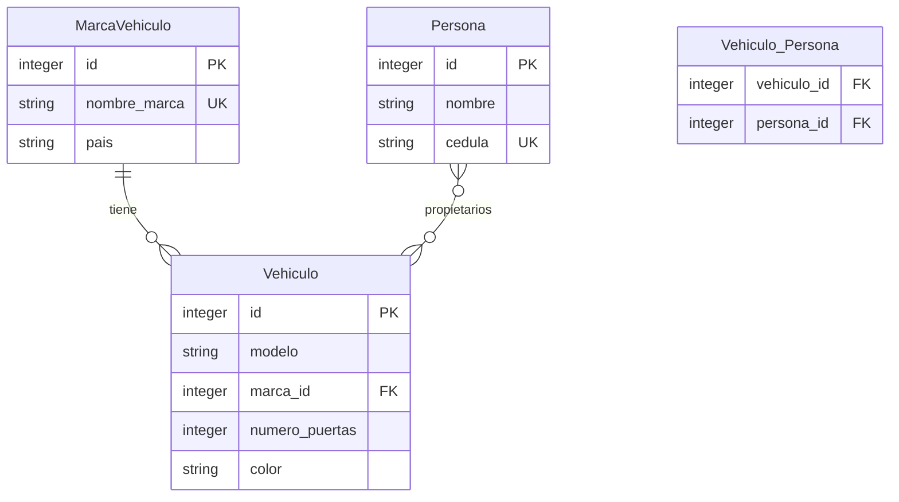

# API de Gestión de Vehículos - ICANH

API RESTful desarrollada con FastAPI y SQLite para la gestión de vehículos, marcas, personas y sus relaciones Many-to-Many.

## 🚀 Características

- **Framework**: FastAPI con Python
- **Base de datos**: SQLite
- **ORM**: SQLAlchemy 2.0
- **Validación**: Pydantic
- **Documentación**: Swagger UI automática
- **Colección Postman**: Incluida para testing
- **Arquitectura**: Modular y escalable

## 📊 Diagrama de Base de Datos



## 🏗️ Estructura del Proyecto

```
ICANH_Project/
├── main.py                    # Archivo principal de FastAPI
├── requirements.txt           # Dependencias del proyecto
├── README.md                  # Documentación del proyecto
├── ICANH_Vehiculos_Postman_Collection.json  # Colección Postman
├── app/
│   ├── database/
│   │   ├── __init__.py
│   │   └── database.py        # Configuración de base de datos
│   ├── models/
│   │   ├── __init__.py
│   │   └── models.py          # Modelos SQLAlchemy
│   ├── routes/
│   │   ├── __init__.py
│   │   ├── marca_vehiculo.py  # Endpoints de marcas
│   │   ├── persona.py         # Endpoints de personas
│   │   └── vehiculo.py        # Endpoints de vehículos
│   └── schemas/
│       ├── __init__.py
│       └── schemas.py         # Esquemas Pydantic
└── vehiculos.db              # Base de datos SQLite (creada automáticamente)
```

## 📋 Requisitos

- Python 3.8+
- pip (gestor de paquetes de Python)

## 🛠️ Instalación

1. **Clonar o descargar el proyecto**
   ```bash
   # Si es un repositorio
   git clone <url-del-repositorio>
   cd ICANH_Project
   ```

2. **Crear entorno virtual (recomendado)**
   ```bash
   python -m venv venv
   # En Windows
   venv\Scripts\activate
   # En Linux/Mac
   source venv/bin/activate
   ```

3. **Instalar dependencias**
   ```bash
   pip install -r requirements.txt
   ```

4. **Ejecutar la aplicación**
   ```bash
   uvicorn main:app --reload
   ```

5. **Verificar funcionamiento**
   - Abrir navegador en: `http://localhost:8000`
   - Documentación Swagger: `http://localhost:8000/docs`
   - Documentación ReDoc: `http://localhost:8000/redoc`

## 📚 API Endpoints

### Marcas de Vehículo
- `GET /api/marcas-vehiculo/` - Listar todas las marcas
- `POST /api/marcas-vehiculo/` - Crear nueva marca
- `GET /api/marcas-vehiculo/{id}` - Obtener marca por ID
- `PUT /api/marcas-vehiculo/{id}` - Actualizar marca
- `DELETE /api/marcas-vehiculo/{id}` - Eliminar marca

### Personas
- `GET /api/personas/` - Listar todas las personas
- `POST /api/personas/` - Crear nueva persona
- `GET /api/personas/{id}` - Obtener persona por ID
- `PUT /api/personas/{id}` - Actualizar persona
- `DELETE /api/personas/{id}` - Eliminar persona
- `GET /api/personas/{id}/vehiculos/` - Obtener vehículos de una persona

### Vehículos
- `GET /api/vehiculos/` - Listar todos los vehículos
- `POST /api/vehiculos/` - Crear nuevo vehículo
- `GET /api/vehiculos/{id}` - Obtener vehículo por ID
- `PUT /api/vehiculos/{id}` - Actualizar vehículo
- `DELETE /api/vehiculos/{id}` - Eliminar vehículo
- `GET /api/vehiculos/{id}/propietarios/` - Obtener propietarios de un vehículo
- `POST /api/vehiculos/{id}/propietarios/` - Asignar propietario a vehículo

### Endpoints Generales
- `GET /` - Bienvenida
- `GET /health` - Health check

## 🔍 Validaciones Implementadas

### MarcaVehiculo
- `nombre_marca`: Requerido, único, string
- `pais`: Requerido, string

### Persona
- `nombre`: Requerido, string
- `cedula`: Requerido, único, string

### Vehiculo
- `modelo`: Requerido, string
- `marca_id`: Requerido, debe existir en MarcaVehiculo
- `numero_puertas`: Requerido, integer
- `color`: Requerido, string

### Relaciones
- Una marca puede tener múltiples vehículos
- Una persona puede tener múltiples vehículos (Many-to-Many)
- Un vehículo puede tener múltiples propietarios (Many-to-Many)
- Validación de existencia de entidades relacionadas
- Prevención de duplicados en relaciones Many-to-Many

## 🧪 Testing con Postman

1. **Importar colección**: Abrir Postman e importar `ICANH_Vehiculos_Postman_Collection.json`
2. **Configurar variable**: En Variables de colección, ajustar `base_url` si es necesario
3. **Ejecutar pruebas**: Los endpoints están organizados por entidad con ejemplos de uso

### Ejemplos de Uso

#### Crear Marca
```json
POST /api/marcas-vehiculo/
{
  "nombre_marca": "Toyota",
  "pais": "Japón"
}
```

#### Crear Persona
```json
POST /api/personas/
{
  "nombre": "Juan Pérez",
  "cedula": "123456789"
}
```

#### Crear Vehículo
```json
POST /api/vehiculos/
{
  "modelo": "Corolla",
  "marca_id": 1,
  "numero_puertas": 4,
  "color": "Rojo"
}
```

#### Asignar Propietario a Vehículo
```json
POST /api/vehiculos/1/propietarios/
{
  "persona_id": 1
}
```

## 🏃‍♂️ Ejecución de Pruebas

### Prueba Básica
```bash
# Verificar que la API responde
curl http://localhost:8000/

# Verificar health check
curl http://localhost:8000/health
```

### Pruebas de Funcionalidad
1. Crear una marca
2. Crear una persona
3. Crear un vehículo (referenciando la marca)
4. Asignar la persona como propietaria del vehículo
5. Consultar los vehículos de la persona
6. Consultar los propietarios del vehículo

## 🔧 Configuración Avanzada

### Variables de Entorno
Crear un archivo `.env` para configuraciones personalizadas:

```env
DATABASE_URL=sqlite:///./vehiculos.db
DEBUG=True
```

### Puerto Personalizado
```bash
uvicorn main:app --host 0.0.0.0 --port 8080 --reload
```

## 📖 Documentación Técnica

### Dependencias Principales
- **FastAPI**: Framework web moderno y rápido
- **SQLAlchemy**: ORM para Python
- **Pydantic**: Validación de datos
- **Uvicorn**: Servidor ASGI

### Arquitectura
- **Routers modularizados** por entidad
- **Separación de responsabilidades** (models, schemas, routes, database)
- **Inyección de dependencias** para manejo de base de datos
- **Validación automática** con Pydantic
- **Documentación automática** con Swagger/OpenAPI

## 🤝 Contribución

1. Fork el proyecto
2. Crear rama para feature (`git checkout -b feature/nueva-funcionalidad`)
3. Commit cambios (`git commit -am 'Agrega nueva funcionalidad'`)
4. Push a la rama (`git push origin feature/nueva-funcionalidad`)
5. Crear Pull Request

## 📝 Licencia

Este proyecto está bajo la Licencia MIT. Ver el archivo `LICENSE` para más detalles.

## 📞 Soporte

Para soporte técnico o preguntas:
- **Email**: soporte@icanh.gov.co
- **Institución**: Instituto Colombiano de Antropología e Historia (ICANH)

---

**Desarrollado con ❤️ para el ICANH**
